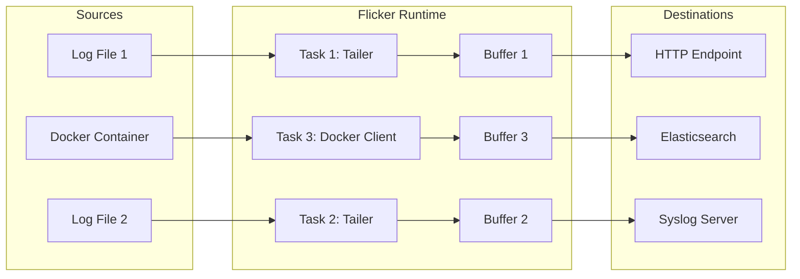

# Architecture

Flicker uses a task-based architecture where every log source runs independently.

## Task Isolation

Unlike some agents that use a shared event loop for all processing, Flicker spawns a dedicated Tokio task for every configured log file or Docker container.

## Buffering Strategy

To optimize network usage and reduce latency, Flicker uses a **dual-trigger** buffering strategy. A buffer flushes when **EITHER** condition is met:

1.  **Size Trigger**: The buffer reaches `buffer_size` (e.g., 100 lines). This ensures high-throughput logs are batched efficiently.
2.  **Time Trigger**: The `flush_interval_ms` elapses (e.g., 30 seconds). This ensures low-volume logs are eventually shipped even if the buffer isn't full.

## Data Flow

1.  **Poll**: The tailer checks for new content (via filesystem seek or Docker API).
2.  **Filter**: New lines are checked against `match_on` and `exclude_on` regexes.
3.  **Buffer**: Accepted lines are pushed to the in-memory buffer.
4.  **Flush**: If a trigger fires, the batch is sent to the configured destination.
5.  **Retry**: If the destination fails, the batch moves to a per-task Retry Queue with exponential backoff.
6.  **Persist**: (Optional) The current read position is sent to the Registry task to be saved to disk.
